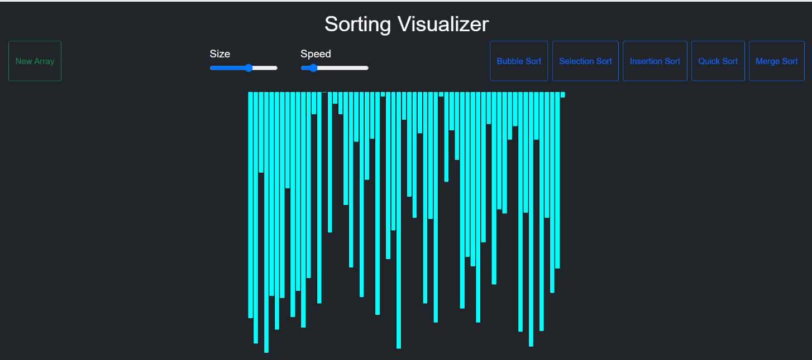
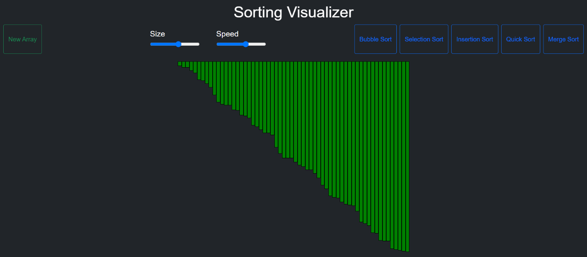

# Sorting_algo_viz

Welcome to the Sorting Algorithms Visualizer! This tool helps you understand and visualize how various sorting algorithms work by displaying the sorting process in real-time.

### Features

1. Visualizes common sorting algorithms such as Bubble Sort, Quick Sort, Merge Sort, and more.
2. Interactive interface allowing users to observe different sorting methods.
3. Adjustable parameters such as array size and speed to enhance the learning experience.

### Installation (To work with)

To fork the repository, click the "Fork" Button;
In the upper right corner of the repository page, you will see a button labeled "Fork". Click this button.

Clone the repository by the icon or the command below:
* Clone
  ```sh
  git clone https://github.com/RyanTuscano/Sorting_algo_viz.git
  cd Sorting_algo_viz
  ```

### Technologies 

-> HTML
-> CSS
-> JavaScript
-> React.js  (Will soon be used with more algorithms and features)






